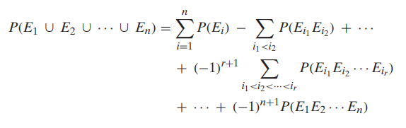

# Congregate Notes

### Methods for Counting
|method|detail|
|---|---|
|permutations|ordering of distinguished items, n!|
|permutation w/ alikes|$\cfrac{n!}{n_1!n_2!\cdots n_r!}$ where $n_1$ is the number of one kind of alike items|
|combinations|Number of ways to group items together (order doesn't matter) ${n \choose k}$|
|divisions into **distinct** groups|$\cfrac{n!}{n_1!n_2!\cdots n_r!}$ possible divisions of n distinct objects into r distinct groups of respective sizes|
|multinomial theorem|$\begin{array}{ll} &(x_1+x_2+\cdots +x_r)^n \\ = &\sum_{(n_1,\cdots, n_r)}{n\choose n_1,n_2,\cdots ,n_r}x_1^{n_1}x_2^{n_2}\cdots x_3^{n_3} \end{array}$|
|# of integer sums|1. distinct positive integers summing up to n: ${n-1 \choose r-1}$ 2. distinct non-negative integer summing up to n: ${n+r-1 \choose r-1}$|

 

### Axioms of Probability
|axiom|def.|
|---|---|
|4.1|$P(E^c)=1-P(E)$|
|4.2|If $E \subset F, then P(E) \leq P(F)$|
|4.3|$P(E\cup F)=P(E)+P(F)-P(EF)$|
|4.4||

 

### Conditional Probability and Independence

 

### Terms
|terms|def.|
|---|---|
|sample space|$S$ or $\Omega$|
|event|$E$|
|intersection|$E \cup F = EF$|
|uniform probability|Each event is equally likely to occure|