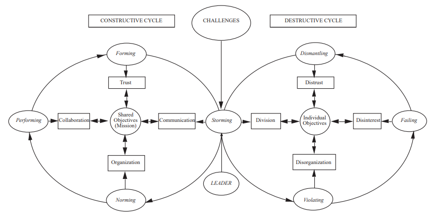
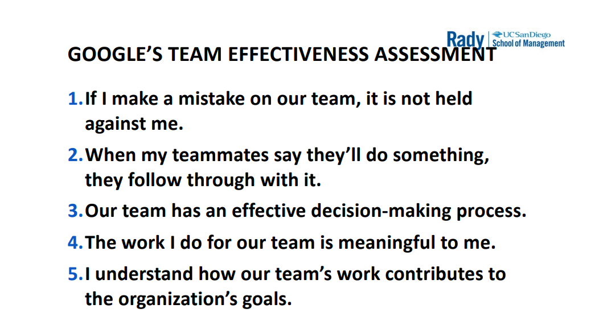

# Midterm Congergate

- [Week 1: The Business Case for Diversity](#week-1-the-business-case-for-diversity)
  - [Marshall Goldsmith](#marshall-goldsmith)
  - [Phillips](#phillips)
  - [Page](#page)
- [Week 2: Unconscious Bias, In-group Favoritism, Social Identity Theory](#week-2-unconscious-bias-in-group-favoritism-social-identity-theory)
  - [Sucher](#sucher)
  - [Charlesworth and Banaji](#charlesworth-and-banaji)
  - [Banaji, Bazermar and Chugh](#banaji-bazermar-and-chugh)
  - [Geert Hofstede](#geert-hofstede)
  - [Henry Tajfel and John Turner](#henry-tajfel-and-john-turner)
- [Week 3: Diverse Teams at Work](#week-3-diverse-teams-at-work)
  - [Pentland](#pentland)
  - [Six Common Misperceptions about Teamwork (Hackman)](#six-common-misperceptions-about-teamwork-hackman)
  - [Cardona, Miller (Work Teams)](#cardona-miller-work-teams)
- [Week 4: Understand Before You are Understood: Psychological Safety](#week-4-understand-before-you-are-understood-psychological-safety)
  - [Edmondson, Roloff (Psycological Saftey)](#edmondson-roloff-psycological-saftey)
- [Week 5: Personality Matters](#week-5-personality-matters)
  - [Vicksberg](#vicksberg)
- [Slides](#slides)
- [Appendix](#appendix)

  

### Week 1: The Business Case for Diversity
#### Marshall Goldsmith
|idea|detail|
|---|---|
|diversity tension|Diversity tension is the stress and strain that accompanies mixtures of differences and similarities. Leaders should not minimize the tension, but to be comfortable with it and use it as a creative force for change.|

#### Phillips
|idea|detail|
|---|---|
|key to positive diversity|1. information diversity 2. social diversity (gender, race, etc.) provokes thought, breaks anticipation|

#### Page
|idea|detail|
|---|---|
|context|Diversity is natural emerging in corporations, and they have to learn to leverage it|
|thesis|Diversity can improve the bottom line. Page derives links between cognitive differences among team members and bettler collective outcomes at specifc takss: problem solving and prediction|
|superadditivity|1 + 1 = 3. first + second = first + second + (both first and second) |
|diversity trumps ability|Under Conditions: 1. The Problem is Difficult 2. The Calculus Condition (all problems solvers are differently smart) 3. The Diversity Condition (problem is within team's ablity) 4. Reasonably Sized Teams Drawn from Lots of potential Problem Solvers|

 

### Week 2: Unconscious Bias, In-group Favoritism, Social Identity Theory
- 4 Sources of Unintentional Bias
  - Bias that favors one's own group
  - Implicit ofrms of prejudice
  - Conflict of interest
  - Tendency to over claim credit
- Solutions: Be Vigilance
  
#### Sucher
|idea|detail|
|---|---|
|findings from social science research|1. Social categorization and stereotyping are fundamental psychological processes Stereotypes are "social constructs" We hold unconscious and impliciet associations stereotyping and implicit biases can impact behavir Individuals can experience different realities at work Stereotype threat - anticipate & conform to stereotypes|

#### Charlesworth and Banaji
|idea|detail|
|---|---|
|implicit bias|With IAT (Implicit Association Test) data show that implicit biases changes over time (for the better or worse)|
|in-group favoritism| we noramlly feel more comfortable with people we think have overlap group identities with us|

#### Banaji, Bazermar and Chugh
|idea|detail|
|---|---|
|Biases|1. In-Group Favoritism 2. Overclaiming Credit 3. Conflict of Interest}

#### Geert Hofstede
|idea|detail|
|---|---|
|identity pyramid|top: our sense of ourselves as unique individuals middle: identity that is grounded in group memberships. Limit us but create group identity as the same time bottom: being human, universal humanity|

#### Henry Tajfel and John Turner
|idea|detail|
|---|---|
|social identity theory|people tend to classify themselves and others into various social categories|
|functions of social classification|1. segments and orders social environment, providing systematic way of defining others 2. enable an individual to locate or define themselves in the social environment|

 

### Week 3: Diverse Teams at Work

#### Pentland
|idea|detail|
|---|---|
|experiment method|equip members in teams with electronic badge wearable to collect data about their body language, tone of voice. Extract patterns of communication, reveals how people interact|
|dimensions of communication|1. Energy 2. Engagement 3. Exploration having feedback on these categories allow team members to discuss problems in communciation|
|give specific feedback|Giving specific feedback to team members in graphical form can specifically fine tune communication habit of individuals, yielding improvment in the end-product|

#### Six Common Misperceptions about Teamwork (Hackman)
- Harmony helps
- It's good having new members (good to mix up)
- Bigger is better (more resource)
- Face-to-Face interaction is old news
- It all depends on the leader
- Teamwork is magical (all needed is talented teammates)

#### Cardona, Miller (Work Teams)
|idea|detail|
|---|---|
|factors to makes a teamTeam|1. individual members do not take responsiblity for the whole result 2. a small number of people with complementary skills who are committed to a common purpose (5-7 people)|
|right mix of people|a team benefits from the complementarity of its members|
|stages to team development|forming, storming, norming, and performing|
|Carmill Model of Team Development|constructive (shared objectives, trust building ) and destructive cycles |
|guidelines for team meetings|1. right amount of meetings 2. meetings should have a respected start and end time 3. should have a well thought out agenda 4. to be effective and productive as possible 5. everyone should speak up and be engaged|
|three styles of leadership|1. transactional leader 2. transforming leader 3. transcendent leader|

|Elements of the decision making process|Constructive roles|Debilitating roles|
|---|---|---|
|Information gathering| Contributor|Doubter|
|Discussion|Communicator|Distracted|
|Evaluation|Questioner|Diplomat/Dmoniator|
|Action plan|Collaborator|Defeatist|

 

### Week 4: Understand Before You are Understood: Psychological Safety
- acid test (listener): "If you aren't willign to change your mind, you're not really listening"
- acid test (speaker): "Words unheard were never spoken"
- acid test (confronting): "Only confront when you want to grow closer"

#### Edmondson, Roloff (Psycological Saftey)
|idea|detail|
|---|---|
|Three Types of Diversity|1. Separation Diversity (timezone, phsycial location) 2. Variety Diversity (difference in speciality) 3. Disparity Diversity (social status, power)
|google|"As long as everyone got a chacne to talk, the team did well. But if only one person or a small gorup spoke all the time ,the collective intelligence declined"|
|how|positive team climate -> supportive, consultative behaviors and challenge their team|

 

### Week 5: Personality Matters

#### Vicksberg
|type|values|characteristics|
|---|---|---|
|Pioneers| *value possibilities* |  adaptable, energetic, exploratory, outgoing, novelty-seeking, expressive, spontaneous, creative, risk taking, brainstormers|
|Drivers|  *value challenge/momentum* | determined, disciplined, willing to take risks, though and resolute, ambitious, intensely curious, competitive, goal-oriented, logical and experimental|
|Integrators| *value connection* |  values relationships, gonsensus oriented, diplomatic, empathic, traditional, intrinsically motivated, non-confrontational, contextual, trusting, optimistic|
|Guardians| *value stability* | methodical, controlled, detail oriented, respected, meticulous, realistic, planners, risk averse, reserved, conventional|

 

### Slides

  
  

#### Appendix
- Readings
  - Primer on Social Identity: Understanding Group Membership (Martin N. Davidson)
  - Differences at Work: The Individual Experience (Sandra J. Sucher)
  - Social Identity Profile (Marin N. Davidson)
  - Leadership in Work Teams (Pablo Cardona, Paddy Miller)
  - Leveraging Diversity Through Psychological Safety (Amy C. Edmondson, Kathryn S. Roloff)